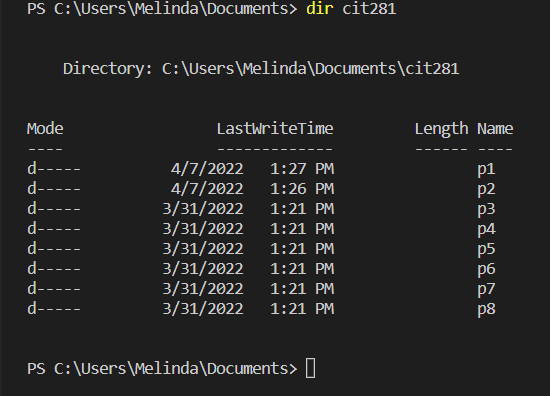
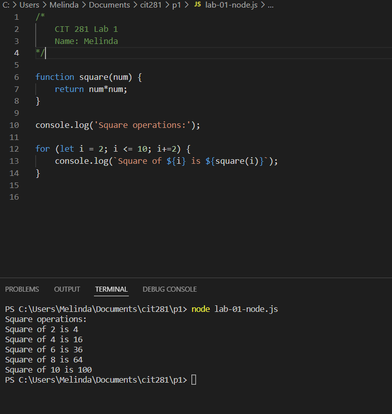

# Lab 1

### Purpose
- Install software required for this class such as Node.js, git and Postman
- Practice using the terminal and CLI to execute commands
- Practice keyboard shortcuts in VSCode

### Technologies
- VSCode
- Node.js
- Postman
- VSCode terminal and command line interface (CLI)

### Takeaways
- Learned how to use my operating system's CLI to execute commands (ex: create new folders, list directory of a folder to a file etc.)
- Gained more experience using VSCode shortcuts 
- Learned to execute Node JavaScript file using Node.js in VSCode Run and Debug

## Images ##

### Directory listing of folders in cit281 folder ### 

### Executing code using node in VSCode terminal ### 

